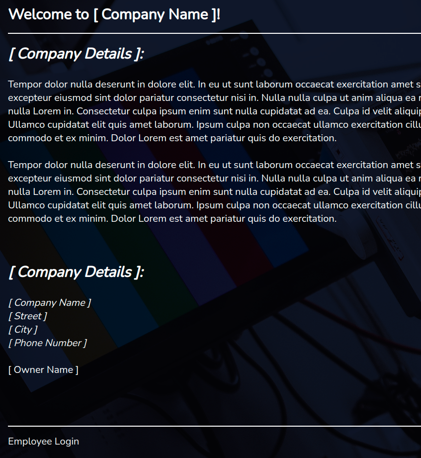

## >>> Project Portfolio

> On my project portfolio page, I showcase exactly the same projects, but in a fancy and time consuming (fun, though!) way.
>
> Obviously, the most recent projects are displayed first on GitHub, as I use it extensively for version control.
>
> <br>
>
> <div align="center">
>  <a href="https://shcoobz.github.io/">
>    
>  </a>
>
> <a href="https://github.com/Shcoobz/list_projects">
>     
>   </a>
> </div>
>
> <br>

<br>

##

<br>

## >>> Highlights

Demo takes some time to load, because of render, sorry! :)

<table>
  <tr>
    <td align="center">
      
      <strong>TechDoc-Hub</strong>
    </td>
    <td align="center">
      
      
    </td>
    <td align="center">
      
      <a href="https://github.com/Shcoobz/advancedJS_mern_techdoc-hub/">
        
      </a>
    </td>
    <td align="center">
      
      <a href="https://advancedjs-mern-techdoc-hub.onrender.com/">
        
      </a>
    </td>
  </tr>
</table>

<br>

##

<br>

<!-- GitHub Streak Stats -->
<div align="center">
  
  <!-- shadow-green  -->
</div>

<br>

<!--START_SECTION:waka-->
**I'm an Early 🐤** 

```text
🌞 Morning                518 commits         █████░░░░░░░░░░░░░░░░░░░░   18.16 % 
🌆 Daytime                1028 commits        █████████░░░░░░░░░░░░░░░░   36.04 % 
🌃 Evening                1304 commits        ███████████░░░░░░░░░░░░░░   45.72 % 
🌙 Night                  2 commits           ░░░░░░░░░░░░░░░░░░░░░░░░░   00.07 % 
```
📅 **I'm Most Productive on Tuesday** 

```text
Monday                   380 commits         ███░░░░░░░░░░░░░░░░░░░░░░   13.32 % 
Tuesday                  497 commits         ████░░░░░░░░░░░░░░░░░░░░░   17.43 % 
Wednesday                306 commits         ███░░░░░░░░░░░░░░░░░░░░░░   10.73 % 
Thursday                 446 commits         ████░░░░░░░░░░░░░░░░░░░░░   15.64 % 
Friday                   368 commits         ███░░░░░░░░░░░░░░░░░░░░░░   12.90 % 
Saturday                 475 commits         ████░░░░░░░░░░░░░░░░░░░░░   16.65 % 
Sunday                   380 commits         ███░░░░░░░░░░░░░░░░░░░░░░   13.32 % 
```


📊 **This Week I Spent My Time On** 

```text
💬 Programming Languages: 
JavaScript               6 hrs 15 mins       ███████████████████████░░   93.06 % 
Markdown                 22 mins             █░░░░░░░░░░░░░░░░░░░░░░░░   05.65 % 
CSS                      3 mins              ░░░░░░░░░░░░░░░░░░░░░░░░░   00.93 % 
HTML                     1 min               ░░░░░░░░░░░░░░░░░░░░░░░░░   00.32 % 
Git Config               0 secs              ░░░░░░░░░░░░░░░░░░░░░░░░░   00.04 % 

🔥 Editors: 
VS Code                  6 hrs 43 mins       █████████████████████████   100.00 % 

🐱‍💻 Projects: 
advancedJS_mern_the-curat6 hrs 43 mins       █████████████████████████   100.00 % 

💻 Operating System: 
Linux                    6 hrs 43 mins       █████████████████████████   100.00 % 
```

**I Mostly Code in JavaScript** 

```text
JavaScript               115 repos           ██████████████░░░░░░░░░░░   54.25 % 
Java                     40 repos            █████░░░░░░░░░░░░░░░░░░░░   18.87 % 
HTML                     9 repos             █░░░░░░░░░░░░░░░░░░░░░░░░   04.25 % 
CSS                      6 repos             █░░░░░░░░░░░░░░░░░░░░░░░░   02.83 % 
TypeScript               1 repo              ░░░░░░░░░░░░░░░░░░░░░░░░░   00.47 % 
```


 Last Updated on 29/08/2024 23:17:56 UTC
<!--END_SECTION:waka-->

<br>

<!-- Visitor counter -->
<div align="center">
   
</div>

##

<!-- Snake eating commits -->
<div align="center">

</div>
