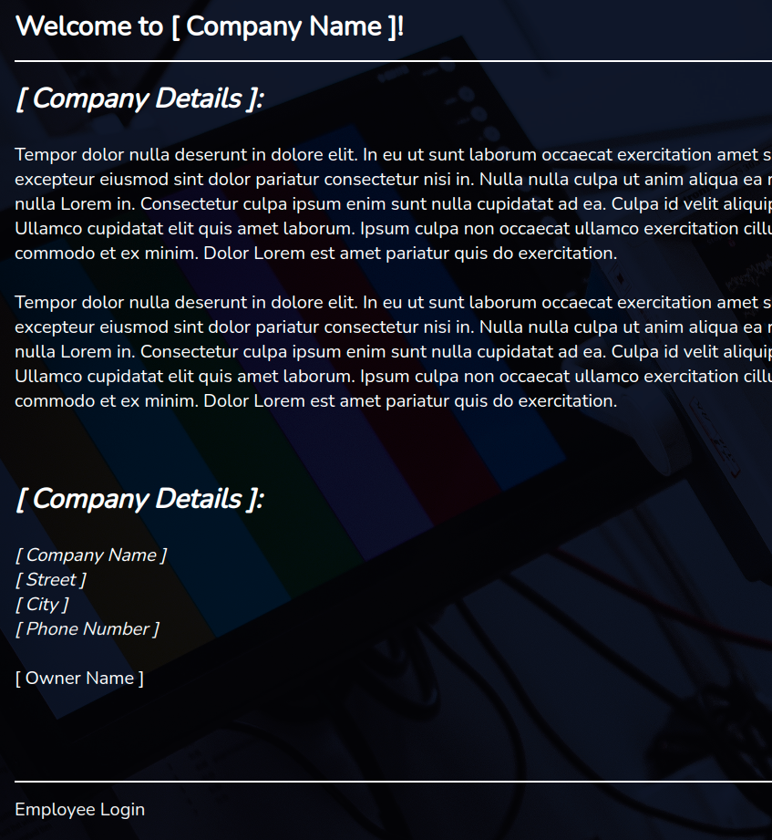

## >>> Project Portfolio

> On my project portfolio page, I showcase exactly the same projects, but in a fancy and time consuming (fun, though!) way.
>
> Obviously, the most recent projects are displayed first on GitHub, as I use it extensively for version control.
>
> <br>
>
> <div align="center">
>  <a href="https://shcoobz.github.io/">
>    
>  </a>
>
> <a href="https://github.com/Shcoobz/list_projects">
>     
>   </a>
> </div>
>
> <br>

<br>

##

<br>

## >>> Highlights

Demo takes some time to load, because of render, sorry! :)

<table>
  <tr>
    <td align="center">
      
      <strong>TechDoc-Hub</strong>
    </td>
    <td align="center">
      
      
    </td>
    <td align="center">
      
      <a href="https://github.com/Shcoobz/advancedJS_mern_techdoc-hub/">
        
      </a>
    </td>
    <td align="center">
      
      <a href="https://advancedjs-mern-techdoc-hub.onrender.com/">
        
      </a>
    </td>
  </tr>
</table>

<br>

##

<br>

<!-- GitHub Streak Stats -->
<div align="center">
  
  <!-- shadow-green  -->
</div>

<br>

<!--START_SECTION:waka-->
**I'm an Early 🐤** 

```text
🌞 Morning                539 commits         ███░░░░░░░░░░░░░░░░░░░░░░   13.27 % 
🌆 Daytime                1623 commits        ██████████░░░░░░░░░░░░░░░   39.97 % 
🌃 Evening                1897 commits        ████████████░░░░░░░░░░░░░   46.71 % 
🌙 Night                  2 commits           ░░░░░░░░░░░░░░░░░░░░░░░░░   00.05 % 
```
📅 **I'm Most Productive on Tuesday** 

```text
Monday                   554 commits         ███░░░░░░░░░░░░░░░░░░░░░░   13.64 % 
Tuesday                  677 commits         ████░░░░░░░░░░░░░░░░░░░░░   16.67 % 
Wednesday                480 commits         ███░░░░░░░░░░░░░░░░░░░░░░   11.82 % 
Thursday                 621 commits         ████░░░░░░░░░░░░░░░░░░░░░   15.29 % 
Friday                   537 commits         ███░░░░░░░░░░░░░░░░░░░░░░   13.22 % 
Saturday                 641 commits         ████░░░░░░░░░░░░░░░░░░░░░   15.78 % 
Sunday                   551 commits         ███░░░░░░░░░░░░░░░░░░░░░░   13.57 % 
```


📊 **This Week I Spent My Time On** 

```text
💬 Programming Languages: 
No Activity Tracked This Week

🔥 Editors: 
No Activity Tracked This Week

🐱‍💻 Projects: 
No Activity Tracked This Week

💻 Operating System: 
No Activity Tracked This Week
```

**I Mostly Code in JavaScript** 

```text
JavaScript               116 repos           ██████████████░░░░░░░░░░░   54.46 % 
Java                     40 repos            █████░░░░░░░░░░░░░░░░░░░░   18.78 % 
HTML                     9 repos             █░░░░░░░░░░░░░░░░░░░░░░░░   04.23 % 
CSS                      6 repos             █░░░░░░░░░░░░░░░░░░░░░░░░   02.82 % 
TypeScript               1 repo              ░░░░░░░░░░░░░░░░░░░░░░░░░   00.47 % 
```


 Last Updated on 03/04/2026 23:34:35 UTC
<!--END_SECTION:waka-->

<br>

<!-- Visitor counter -->
<div align="center">
   
</div>

##

<!-- Snake eating commits -->
<div align="center">

</div>
